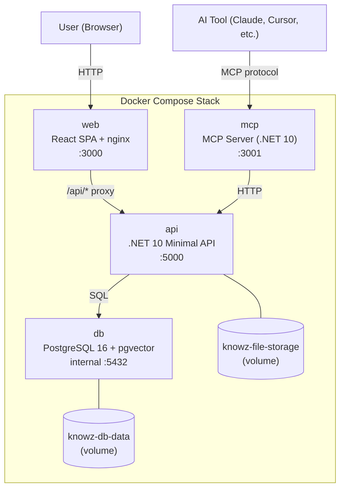
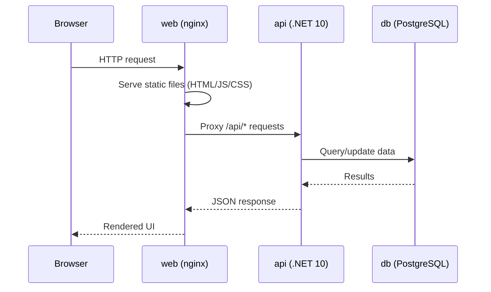
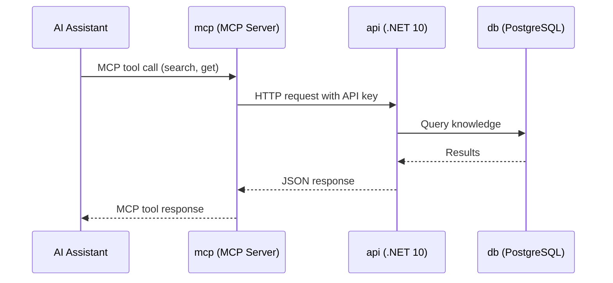
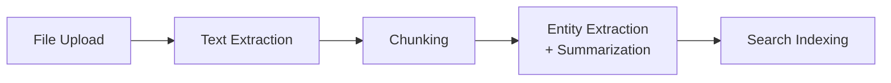

# Architecture Overview

Knowz Self-Hosted runs as a 4-service Docker Compose stack. This document describes the system design, service interactions, and extension points.

## System Diagram

## Services

### db -- PostgreSQL 16 + pgvector

- **Image:** `pgvector/pgvector:pg16`
- **Purpose:** Stores all application data -- users, tenants, vaults, knowledge items, tags, entities, chat history, configuration -- plus chunk embeddings in `vector` columns
- **Extension:** `vector`, created on first startup; similarity search uses the `<=>` cosine-distance operator
- **Health check:** `pg_isready` every 10 seconds, healthy after successful connection
- **Network:** compose-internal only (`db:5432`). No host port is published. Loopback opt-in is documented in `docker-compose.yml` and `docs/CONFIGURATION.md`
- **Data persistence:** Docker volume `knowz-db-data` mounted at `/var/lib/postgresql/data`

### api -- Knowz Self-Hosted API

- **Runtime:** .NET 10 Minimal API
- **Purpose:** Core application server handling all business logic, authentication, data access, file storage, and the enrichment pipeline
- **Internal port:** 8080 (mapped to host port 5000)
- **Dependencies:** Requires `db` to be healthy before starting
- **Auto-migration:** On first startup, automatically creates database tables and seeds the SuperAdmin account
- **Health check:** HTTP GET to `/healthz` every 30 seconds
- **Data persistence:** Docker volume `knowz-file-storage` mounted at `/data/files`

Key responsibilities:
- JWT and API key authentication
- CRUD operations for vaults, knowledge items, tags, entities
- File upload and storage (local filesystem or Azure Blob)
- AI-powered search (when Azure AI Search is configured)
- Chat with knowledge base (when Azure OpenAI is configured)
- Background enrichment pipeline (text extraction, chunking, entity extraction, summarization)
- SSO via Microsoft Entra ID
- Data import/export (portability)
- Swagger/OpenAPI documentation (off unless `ENABLE_SWAGGER=true`)

### web -- Knowz Web UI

- **Runtime:** React SPA served by nginx
- **Purpose:** Browser-based user interface for all Knowz features
- **Internal port:** 8080 (mapped to host port 3000)
- **Dependencies:** Starts after `api` is running
- **Routing:** nginx serves static files and reverse-proxies `/api/*` requests to the API service

### mcp -- Model Context Protocol Server

- **Runtime:** .NET 10
- **Purpose:** Provides a standardized MCP interface for AI tools to query the knowledge base
- **Internal port:** 8080 (mapped to host port 3001)
- **Dependencies:** Requires `api` to be healthy
- **Health check:** HTTP GET to `/.well-known/oauth-authorization-server` every 30 seconds
- **Architecture:** Pure proxy -- no database connection, forwards all requests to the API

AI assistants (Claude Desktop, Cursor, VS Code extensions, etc.) connect to the MCP server to:
- Search knowledge using natural language
- Retrieve specific knowledge items
- List vaults and their contents

## Data Flow

### User Interaction

### AI Tool Integration

### Enrichment Pipeline

When a knowledge item is created or updated with file attachments, the API runs a background enrichment pipeline:

This pipeline runs in-process as a background service (no external message queue required). Each step is optional and depends on configured AI services:

| Step | Requires | Purpose |
|------|----------|---------|
| Text Extraction | Built-in | Extract text from uploaded files |
| Chunking | Built-in | Split long content into searchable chunks |
| Entity Extraction | Azure OpenAI | Identify people, places, organizations in content |
| Summarization | Azure OpenAI | Generate concise summaries |
| Search Indexing | PostgreSQL + pgvector | Store chunk embeddings for vector similarity search |

## Storage Architecture

### Database

A single PostgreSQL 16 database (`knowz_selfhosted`, port `5432`) stores all structured data and, in `vector` columns provided by the pgvector extension, all chunk embeddings. Similarity search uses the `<=>` cosine-distance operator. The schema is managed by EF Core (Npgsql) migrations, applied automatically on startup when `Database__AutoMigrate=true`.

### File Storage

Two storage providers are available:

| Provider | Config Value | Description |
|----------|-------------|-------------|
| Local Filesystem | `LocalFileSystem` | Files stored in a Docker volume (default) |
| Azure Blob Storage | `AzureBlobStorage` | Files stored in Azure Blob (enterprise) |

The local filesystem provider is the default and requires no external services. Files persist in the `knowz-file-storage` Docker volume.

## Authentication

The API supports three authentication methods:

| Method | Header | Use Case |
|--------|--------|----------|
| JWT Bearer Token | `Authorization: Bearer <token>` | Web UI sessions (login via username/password or SSO) |
| Per-User API Key | `X-Api-Key: ksh_...` | Programmatic access, MCP server |
| Legacy Global Key | `X-Api-Key: <key>` | Backward compatibility |

## Extension Points

- **Database-backed configuration** -- Settings stored in the database can be modified at runtime through the Admin UI without restarting services
- **MCP integration** -- Any AI tool supporting the MCP protocol can connect to query your knowledge
- **Data portability** -- Import and export endpoints allow moving data between Knowz instances
- **Azure Key Vault** -- Optional integration for enterprise secret management
- **SSO providers** -- Microsoft Entra ID support with extensible provider architecture
